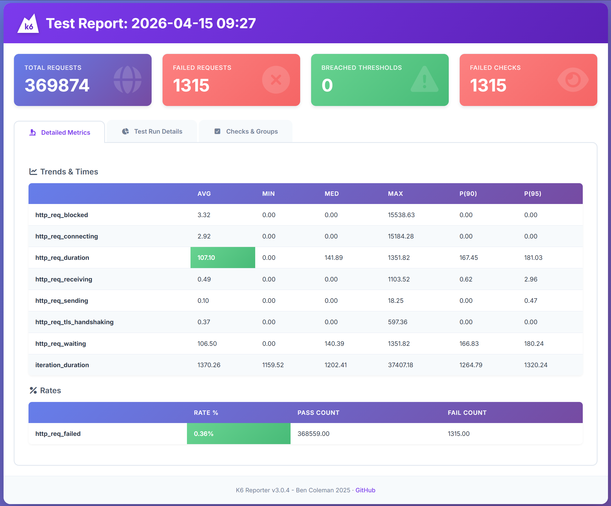
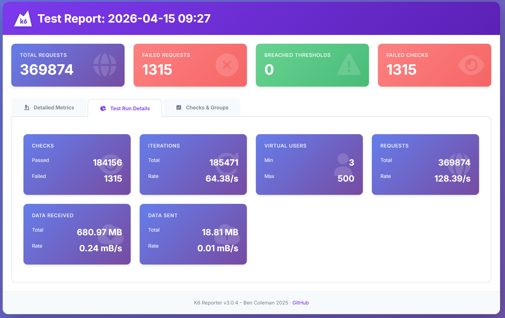
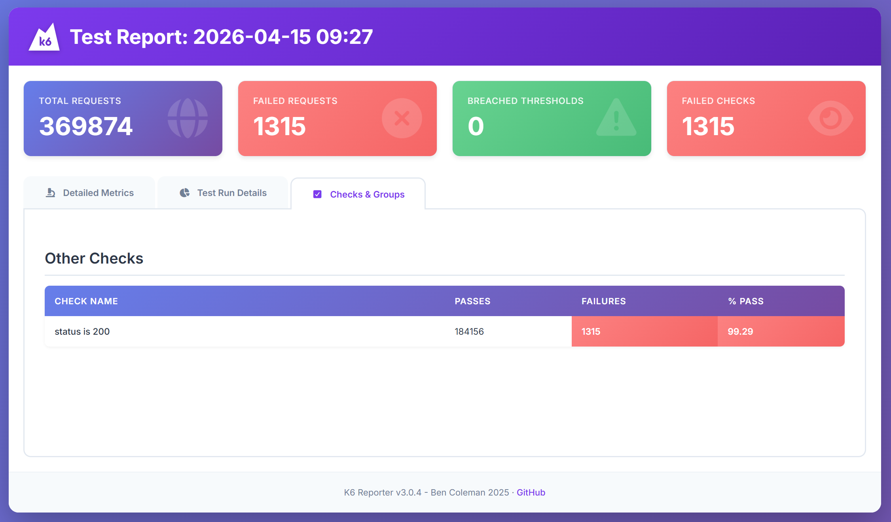

# 🚀 Senior QA Engineering Case Study

## 📂 Proje Yapisi

    - **`api-tests/`**: API koleksiyonlari ve dokumantasyonu.
    - **`automation/`**: Web/API otomasyon calismalari (varsa).
    - **`mobile/`**: Mobil uygulama test notlari ve cihaz spesifik gozlemler.
    - **`performance/`**: k6 performans scriptleri ve detayli raporlar.
    - **`test-cases/`**: Manuel test senaryolari ve Markdown formatinda Bug Raporlari.

# 1. Performans Test #

## 📊 Performans Test Analizi

    Sistemin dayanikliligini olcmek icin 4 asamali bir is yuku modeli (Workload Model) uygulanmistir.

### ⚙️ Test Senaryolari ve Hedefler

    | Test Turu | Yuk (VU) | Sure | Amac | Sonuc |
    | :--- | :---: | :---: | :--- | :--- |
    | **Load Test** | 50 | 5m | Normal trafik altinda baz performans olcumu. | ✅ Basarili |
    | **Stress Test** | 200 | 10m | Sistemin sinir degerlerini ve darbogazlarini tespit. | ✅ Basarili |
    | **Spike Test** | 0→500→0 | 3m | Ani trafik soklarina karsi esneklik ve toparlanma. | ⚠️ Risk Tespit Edildi |
    | **Soak Test** | 30 | 30m | Uzun sureli yuk altinda stabilite ve bellek sizintisi. | ❌ Stabilite Sorunu |

### 📈 Gorsel Raporlar

#### 1. Genel Metrikler ve SLA Uyumlulugu

    Sistem ortalama **107.10 ms** yanit suresi ile 2000ms olan SLA hedefinin cok altinda kalarak yuksek hizda performans sergilemistir.
    

#### 2. Test Yurutme Detaylari (Throughput)

    Saniyede ortalama **128.39** istek islenmis, toplamda ~370 bin istek basariyla yonetilmistir.
    

#### 3. Basari Oranlari (Checks)

    Toplam basari orani **%99.29** olarak gerceklesmistir. 1,315 adet hata Spike fazinda gozlemlenmistir.
    

## 🔍 Teknik Gozlemler ve Analiz (Senior Perspective)

    1. **Breaking Point:** Sistem 200 VU (Stress) seviyesine kadar kusursuz calismaktadir. Ancak 500 VU (Spike) aninda TCP baglanti hatalari (`connectex`) uretmeye baslamistir.
    2. **Recovery Failure:** Spike testi sonrasinda yuk 30 VU seviyesine (Soak) dusurulmesine ragmen hatalarin devam ettigi gozlemlenmistir. Bu durum, sistemin **Self-Healing** (kendi kendini iyilestirme) kapasitesinin zayif oldugunu ve kaynaklarin (Connection Pool) duzgun serbest birakilmadigini kanitlamaktadir.
    3. **Resilience Risk:** Ani trafik artislari sonrasi sistemin manuel mudahale olmadan eski stabil haline donmemesi, prod ortami icin operasyonel bir risk teskil etmektedir.

### 🛠️ oneriler

    - **Altyapi:** Veritabani ve uygulama sunucusu arasindaki baglanti havuzu (Connection Pooling) ayarlari optimize edilmeli.
    - **olceklendirme:** HPA (Horizontal Pod Autoscaler) politikalari, CPU/RAM metriklerinin yani sira "Request per Second" bazli da tetiklenmeli.
    - **Cache:** Ani yukleri karsilamak icin onbellekleme (Redis vb.) stratejileri devreye alinmali.

## 🛠️ Kurulum ve calistirma

### Performans Testlerini Kosturmak icin:
    1. [k6](https://k6.io/) aracini sisteminize kurun.
    2. # Winget ile:
        winget install k6
    3. # Proje ana dizinindeyken asagidaki komutlarla gerekli klasorleri olusturabilirsiniz:
        Performans klasoru ve alt dizinleri
        mkdir -p performance/scripts
        mkdir -p performance/results/screenshots
    4. calistirma
        k6 run performance/scripts/main_test.js

# 2. Automation (Playwright) #
    Cross-Browser Testing: Chromium ve Firefox uzerinde paralel kosum destegi.

    Page Object Model (POM): Surdurulebilir ve moduler kod yapisi.

    Hiyerarsik Raporlama: Ekran goruntuleri test-results/ altinda tarayici ve senaryo bazli otomatik olarak siniflandirilir.

    CI/CD Integration: Her push isleminde Node.js 24 ortaminda otomatik test kosumu ve artifact uretimi.

    Custom Screenshot Engine: Her test adimi icin ozel isimlendirilmis gorsel kanitlar.

## 🛠️ Kurulum ve calistirma
    Bagimlilik Yonetimi: Proje kok dizininde gerekli kutuphaneler yuklenir.

    Bash
    cd automation
    npm install
    Tarayici Motorlari: Playwright'in ihtiyac duydugu izole tarayici paketleri sisteme tanimlanir.

    Bash
    npx playwright install --with-deps
    🏃 Test Yurutme Stratejileri
    Headless Kosum: Tum tarayicilarda (Chrome & Firefox) paralel testler baslatilir.

    Bash
    npx playwright test

### CI/CD ve Raporlama
    Proje, GitHub Actions ile tam entegre calismaktadir:

    Pipeline: Node.js 24 tabanli guncel runner yapisi kullanilmaktadir.

    Artifacts: Test sonrasi olusan ekran goruntuleri GitHub uzerinden indirilebilir.

    Allure Results: Detayli raporlama icin gerekli veri seti reports/allure-results altinda toplanir.

#### Yerel Raporlama ve Kanit Yonetimi
    Hiyerarsik Screenshot Sistemi: Testler bittiginde test-results/ klasoru altinda tarayici ve senaryo bazli .png ciktilari otomatik olarak siniflandirilir.

    Allure Dashboard: Detayli analiz icin yerel raporlama sunucusu baslatilir.

    Bash
    npx allure serve reports/allure-results

##### GitHub Entegrasyonu ve CI/CD Operasyon Sureci
    Kodun paylasilan repoya aktarilmasiyla baslayan otomatik kalite kontrol hatti su sekilde islemektedir:

    📂 Surum Kontrolu ve Filtreleme
    Git Stratejisi: Gereksiz dosyalarin (node_modules, logs vb.) repoyu kirletmemesi icin .gitignore konfigurasyonu uygulanmistir.

    Version Control: Yapilan degisiklikler GitHub Desktop veya Terminal uzerinden muhurlenerek uzak sunucuya gonderilir.

    Bash
    git add .
    git commit -m "feat: setup automation and ci/cd pipeline"
    git push origin main

##### ⚡ GitHub Actions (Pipeline) Akisi
    push islemiyle birlikte .github/workflows/playwright.yml dosyasi tetiklenir ve su surecleri yonetir:

    calisma Ortami: GitHub Ubuntu Runner uzerinde Node.js 24 ortami hazirlanir.

    Bulut Kosumu: Bagimliliklar kurulur ve testler "Headless" modda otomatik olarak calistirilir.

    Artifact Arsivleme: Testler ister basarili ister hatali bitsin, olusan tum ekran goruntuleri GitHub uzerine yuklenir.

    🔍 Bulut Kanitlarinin incelenmesi
    GitHub uzerindeki Actions sekmesine gidilir.

    ilgili "Workflow Run" secilerek sayfanin altindaki Artifacts bolumunden screenshots.zip indirilerek test kanitlari incelenir.

###### Neden Playwright Tercih Edildi?

    Bu projenin temel otomasyon motoru olarak Playwright'in secilme nedenleri, modern web uygulamalarinin test ihtiyaclarina sundugu ustun cozumlerdir

    1. Hiz ve Paralel Kosum (Efficiency)
    Playwright, "Browser Context" mimarisi sayesinde her test icin yeni bir tarayici acmak yerine, saniyeler icinde tertemiz bir tarayici profili olusturur. Bu da 24 test case'inin paralel olarak cok daha kisa surede tamamlanmasini saglar.

    2. Otomatik Bekleme (Auto-Wait)
    Selenium'un aksine, Playwright elemanlarin tiklanabilir veya gorunur olmasini otomatik olarak bekler. Bu ozellik, testlerin kararliligini artirarak "Flaky Test" (bir gecip bir kalan test) oranini minimize eder.

    3. Gercek Cross-Browser Destegi
    Tek bir API ile Chromium (Chrome, Edge), Firefox ve WebKit (Safari) uzerinde %100 uyumlulukla test kosulabilir. Bu projede hem Chromium hem de Firefox uzerinde ayni kodun kosturulmasi bu gucu gostermektedir.

    4. Gelismis Debugging ve Trace Viewer
    Playwright'in sundugu UI Mode ve Trace Viewer, hata aninda DOM'un o anki durumunu, ag (network) isteklerini ve konsol loglarini geriye donuk inceleme imkani verir. Bu, hata analiz suresini (MTTR) ciddi oranda dusurur.

    5. Native Shadow DOM ve iframe Destegi
    Modern web bilesenleri (Shadow DOM) ve karmasik iframe yapilari ile calisirken ek bir konfigurasyona ihtiyac duymadan dogrudan erisim saglar.

# 3. API Test - Restful Booker #

## 3. 1. Postman & Newman 

    Restful-booker API üzerindeki 9 temel senaryo, bağımlı test zinciri (request chaining) mantığıyla kurgulanmıştır.

    Klasör Yolu: api-tests/postman/

    Kullanılan Araçlar: Postman, Newman, JavaScript

    Test Kapsamı: Auth (Token generation), CRUD işlemleri (Create, Get, Update, Delete) ve Negatif senaryolar (403 Forbidden, 404 Not Found doğrulama).

    🛠️ Çalıştırma Talimatı

    Projenin ana dizininde aşağıdaki komutu çalıştırarak tüm API testlerini terminal üzerinden koşturabilirsiniz:

    Bash

    npm run test:api

    (Bu komut arka planda newman run api-tests/postman/postman_collection.json -e api-tests/postman/postman_environment.json komutunu tetikler.)

## 3.2. Playwright & TypeScript 

    Teknik yetkinlik göstergesi olarak, aynı senaryolar modern bir framework olan Playwright ile de kodlanmıştır.

    Klasör Yolu: api-tests/rest_assured_playwright/

    Öne Çıkan Özellikler:

    TypeScript ile tip güvenliği.

    Allure Report entegrasyonu ile görsel raporlama.

    Chain of Requests mimarisi.

    🛠️ Çalıştırma ve Raporlama

    Testleri koşturmak ve görsel raporu açmak için rest_assured_playwright klasörü içerisinde:

    Bash

    npx playwright test

    npx allure serve reports/allure-results