# 1. Bug Report: BUG-001 - Password Field Lack of Max Length Constraint
    •	Bulgu ID: BUG-001

    •	Bulgu Başlığı: Şifre giriş alanında (Password Field) karakter sınırı (maxlength) bulunmaması.

    •	Modül: Kullanıcı Kimlik Doğrulama (Login)

    •	Öncelik (Priority): Low (P3)

    •	Ciddiyet (Severity): Medium
    
    •	TC : TC-0010-Login-Şifre alanı karakter sınırı doğrulaması

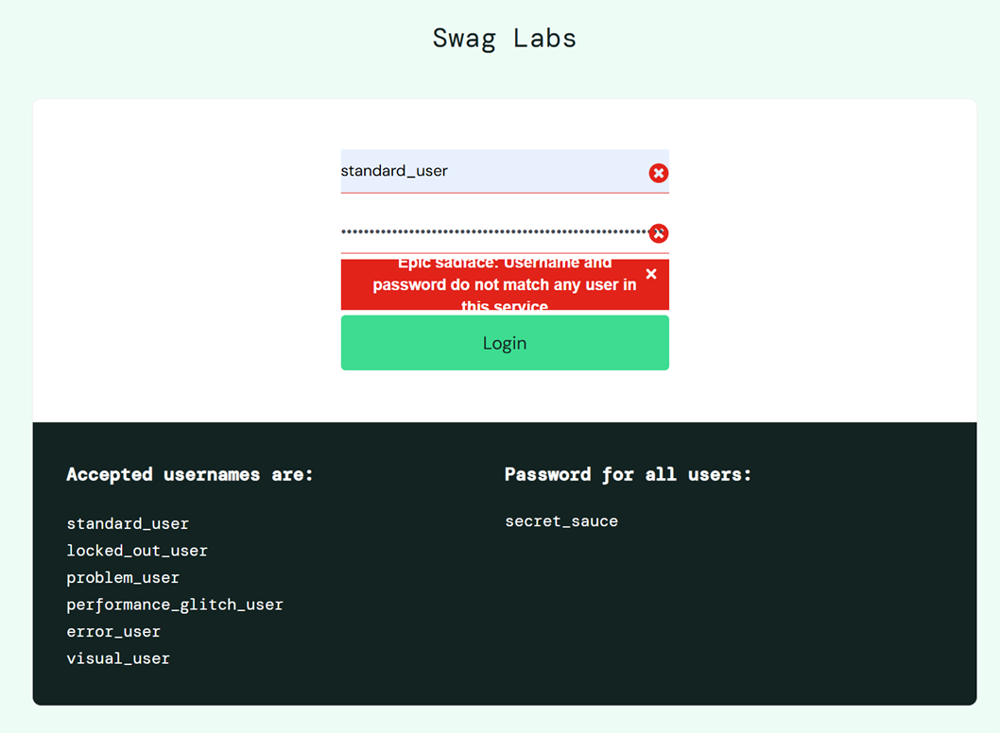

1. Özet: Login sayfasındaki şifre giriş alanında herhangi bir karakter sınırlaması (maxlength attribute) bulunmamaktadır. Kullanıcı bu alana sınırsız uzunlukta veri girebilmektedir.

2. Yeniden Üretme Adımları (Steps to Reproduce):

    2.1.	https://www.saucedemo.com/ adresine gidilir.

    2.2.	Kullanıcı adı alanına geçerli bir kullanıcı adı girilir.

    2.3.	Şifre alanına 1.000+ karakterlik bir metin (veya brute-force test verisi) yapıştırılır.

    2.4.	"Login" butonuna tıklanır.

    2.5.	Network trafiği ve tarayıcı performansı gözlemlenir.

3. Beklenen Sonuç (Expected Result): Şifre alanının güvenlik ve performans standartları gereği makul bir sınırda (örneğin 128 karakter) girişi durdurması veya HTML seviyesinde maxlength özniteliğine sahip olması beklenmektedir.

 4. Gerçekleşen Sonuç (Actual Result): HTML kodunda <input data-test="password"> etiketinde maxlength özniteliği tanımlanmamıştır. Sistem çok uzun dizileri kabul ederek sunucuya iletmeye çalışmaktadır.

5. Risk Analizi:

    •	Performans: Çok uzun karakter dizileri tarayıcının donmasına (client-side freeze) neden olabilir.
    •	Güvenlik: Arka planda bu verinin işlenmesi sırasında ReDoS (Regular Expression Denial of Service) veya Buffer Overflow risklerine zemin hazırlayabilir.
    •	Öneri: Frontend tarafında HTML input alanına maxlength="128" kısıtlaması getirilmelidir. Arka planda (Server-side) da bu sınır doğrulanmalıdır.

# 2. Bug Report: BUG-002 - Incorrect Product Images for Problem User
    •	Bulgu ID: BUG-002

    •	Bulgu Başlığı: Ana sayfadaki tüm ürün görsellerinin aynı (hatalı) olması.

    •	Modül: Ürün Listeleme

    •	Öncelik (Priority): Medium (P2)

    •	Ciddiyet (Severity): Major (Görsel bütünlük ve kullanıcı güveni kaybı)

    •	TC: TC-0027-Ürün Listeleme ve Arama-Hatalı Görsel Kontrolü (Problem User)

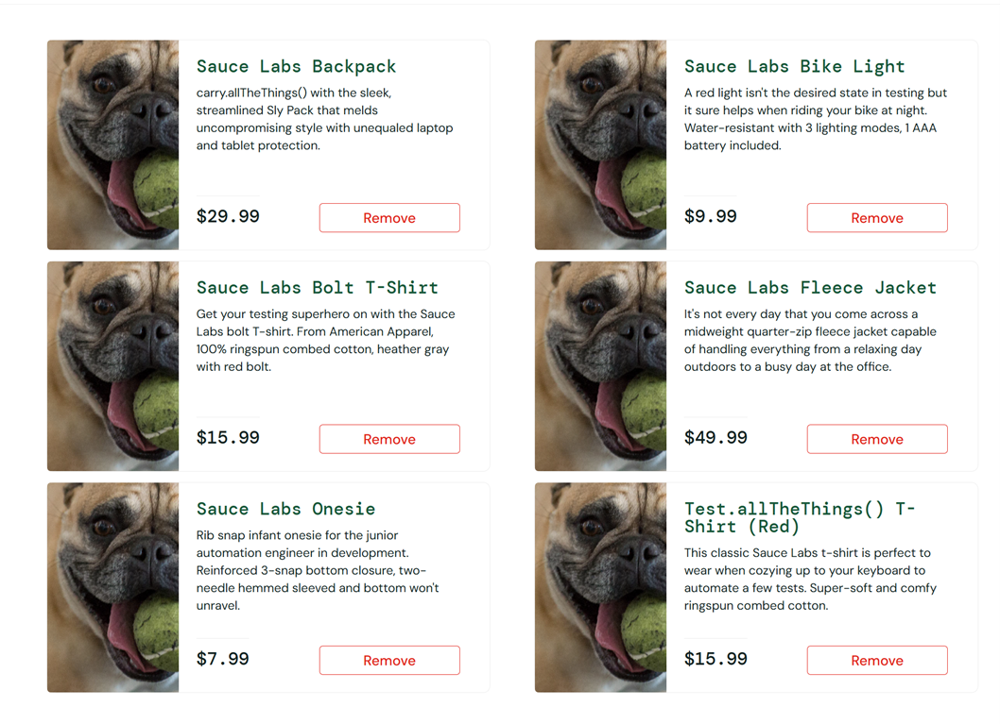

1.	Özet: problem_user ile giriş yapıldığında, ürün listeleme sayfasındaki tüm ürünler gerçek görselleri yerine standart bir "köpek" (sloth) görseliyle görüntülenmektedir.

2.	Yeniden Üretme Adımları:

    2.1. problem_user kimlik bilgileriyle giriş yapılır.
    2.2. Ürün listeleme sayfası (Inventory) incelenir.

3. Beklenen Sonuç: Her ürünün kendine has, tanımlanmış görseliyle listelenmesi.

4. Gerçekleşen Sonuç: Tüm ürün kartlarında aynı hatalı görsel yüklenmektedir.

5. Teknik Not: Inspect yapıldığında src özniteliklerinin statik bir hata görseline yönlendiği görülmektedir.

# 3. Bug Report: BUG-003 - Item Removal Failure from Cart on Main Page

    •	Bulgu ID: BUG-003

    •	Bulgu Başlığı: Ana sayfada sepete eklenen ürünün "Remove" butonuyla silinememesi.

    •	Modül: Sepet Yönetimi

    •	Öncelik (Priority): High (P1 - Satın alma akışını doğrudan etkiler)

    •	Ciddiyet (Severity): Critical (Fonksiyonel engel)

    •	TC: TC-0035-Sepet Yönetimi-Ana sayfadan ürün sil

1.	Özet: Ana sayfada bir ürün "Add to Cart" ile eklendikten sonra buton "Remove" haline gelmektedir. Ancak bu butona basıldığında ürün sepetten çıkarılamamakta, buton durumu değişmemektedir.

2.	Yeniden Üretme Adımları:

    2.1. problem_user ile giriş yapılır.

    2.2. Herhangi bir ürün için "Add to Cart" butonuna basılır.

    2.3. Aynı ürün için aktifleşen "Remove" butonuna tıklanır.

3.	Beklenen Sonuç: Ürünün sepetten çıkarılması ve butonun tekrar "Add to Cart" haline dönmesi.

4.	Gerçekleşen Sonuç: "Remove" butonu tıklamaya yanıt vermemekte, ürün sepetten silinememektedir.

# 4. Bug Report: BUG-004 - Product Data Mismatch Between Inventory and Detail Page

    •	Bulgu ID: BUG-004

    •	Bulgu Başlığı: Ürün listeleme başlığı ile ürün detay sayfası verilerinin uyuşmaması.

    •	Modül: Ürün Listeleme

    •	Öncelik (Priority): High (P1)

    •	Ciddiyet (Severity): Critical (Kullanıcıyı yanlış yönlendirme / Satış hatası)

    •	TC: TC-0029-Ürün Listeleme ve Arama-Ürün Veri Uyuşmazlığı (Problem User) ve TC-0039-Sepet Yönetimi-Ürün Görsel/Link Hataları (Problem User)

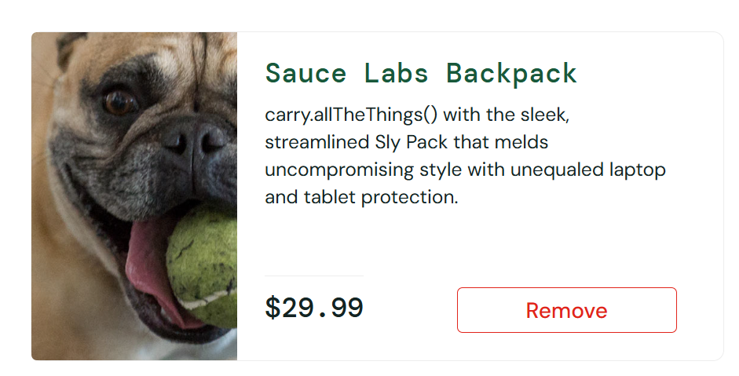
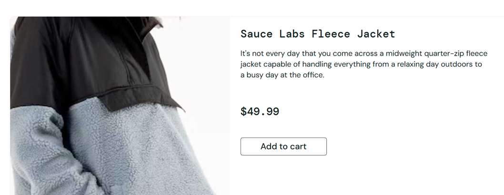

1.	Özet: problem_user akışında, ana sayfada tıklanan bir ürünün (Örn: Backpack) detay sayfasına gidildiğinde, sayfanın bambaşka bir ürüne (Örn: Fleece Jacket) ait verileri ve fiyatı gösterdiği tespit edilmiştir.

2.	Yeniden Üretme Adımları:

    2.1. problem_user ile giriş yapılır.
    2.2. "Sauce Labs Backpack" ürün başlığına tıklanır.
    2.3. Açılan detay sayfası içeriği (İsim, Görsel, Fiyat) kontrol edilir.

3.	Beklenen Sonuç: Tıklanan ürün ID'sine ait spesifik detayların görüntülenmesi.

4.	Gerçekleşen Sonuç: Ürün başlığı "Backpack" olmasına rağmen, detay sayfası içeriği farklı bir ürünle eşleşmektedir.

5.	Risk: Yanlış ürün gönderimi veya fiyatlandırma hataları nedeniyle ciddi müşteri şikayetlerine yol açabilir.

# 5. Bug Report: BUG-005 – Performance problem

    •	Bulgu ID: BUG-005

    •	Bulgu Başlığı: Login işlemi sonrası ana sayfanın yüklenmesinde 5 saniyelik kritik gecikme.
    
    •	Öncelik (Priority): Medium (P2)

    •	Ciddiyet (Severity): Major (Kullanıcı deneyimi ve dönüşüm oranını doğrudan etkiler).

    •	TC: TC-0003-Login-"performance_glitch_user" ile giriş denemesi ve TC-0031-Ürün Listeleme ve Arama-Sayfa Yüklenme Eşiği (performance_glitch_user)

1. Gerçekleşen Sonuç: "Login" butonuna tıklandıktan sonra /inventory.html sayfasının tam olarak yüklenmesi ve ürünlerin etkileşime hazır hale gelmesi yaklaşık 5.3 saniye sürmektedir. Sektör standartlarına göre (Google Core Web Vitals) bu süre "Poor" (Kötü) kategorisindedir.

2. Teknik Analiz: Tarayıcı geliştirici araçları (Network tab) incelendiğinde, login isteğine verilen yanıtın sunucu tarafında bekletildiği görülmüştür. Bu durum gerçek bir senaryoda; optimize edilmemiş SQL sorguları, senkron çalışan ağır arka plan işlemleri veya yetersiz sunucu kaynaklarına işaret eder.

# 6. Bug Report: BUG-006 - Cart Quantity Field Not Editable

    Bulgu ID: BUG-006

    Bulgu Başlığı: Sepet sayfasındaki ürün miktar (QTY) alanının manuel olarak değiştirilememesi.

    Modül: Sepet Yönetimi / Fonksiyonel

    Öncelik (Priority): High (P1)

    Ciddiyet (Severity): Major (Kullanıcı sepet içeriğini güncelleyemiyor)
    
    TC: TC-0034 - Sepet Yönetimi - Ürün miktarı güncelleme

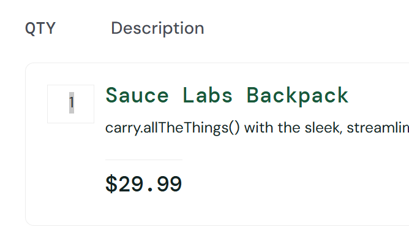

1. Özet: Sepet ekranına gidildiğinde, ürünlerin yanında bulunan miktar (QTY) kutucuğu "read-only" (sadece okunur) durumdadır. Kullanıcı bu alana tıklayıp sayısal bir değer girişi yaparak ürün adedini artıramamakta veya azaltamamaktadır.

2. Yeniden Üretme Adımları:

    2.1.standard_user ile giriş yapılır.

    2.2.Ürün listesinden herhangi bir ürün sepete eklenir.

    2.3.Sağ üstteki sepet ikonuna tıklanarak "Your Cart" sayfasına gidilir.

    2.4.İlgili ürünün solunda bulunan "QTY" kutucuğuna tıklanarak değer değiştirilmeye çalışılır.

3. Beklenen Sonuç: QTY alanının giriş yapılabilir (input) bir alan olması ve kullanıcı miktar değiştirdiğinde sepetin güncellenmesi.
    
4. Gerçekleşen Sonuç: Ürün miktarı alanı (QTY) editable olmadığı için değer değiştirilememektedir. (Referans: image_8004eb.png - Status: Failed)

5. Teknik Not: Bu durum bir tasarım tercihi mi yoksa teknik bir kısıtlama mı olduğu netleştirilmelidir. Eğer miktar değişimi sadece envanter sayfasından yapılıyorsa, sepet sayfasındaki bu alanın görsel olarak kilitli (disabled) görünmesi veya fonksiyonun aktif edilmesi gerekir.

# 7. Bug Report: BUG-007 - Unresponsive "Add to Cart" Buttons for Remaining Products

    •	Bulgu ID: BUG-007

    •	Bulgu Başlığı: Ana sayfadaki 1. 2. ve 5. ürünler hariç diğer ürünler için "Add to Cart" butonlarının çalışmaması.

    •	Modül: Ürün Listeleme / Satın Alma Akışı

    •	Öncelik (Priority): High (P1)

    •	Ciddiyet (Severity): Blocker (Satın alma işlemi başlatılamıyor)

    •	TC: TC-0005-Login-"error_user" ile giriş yapılması.

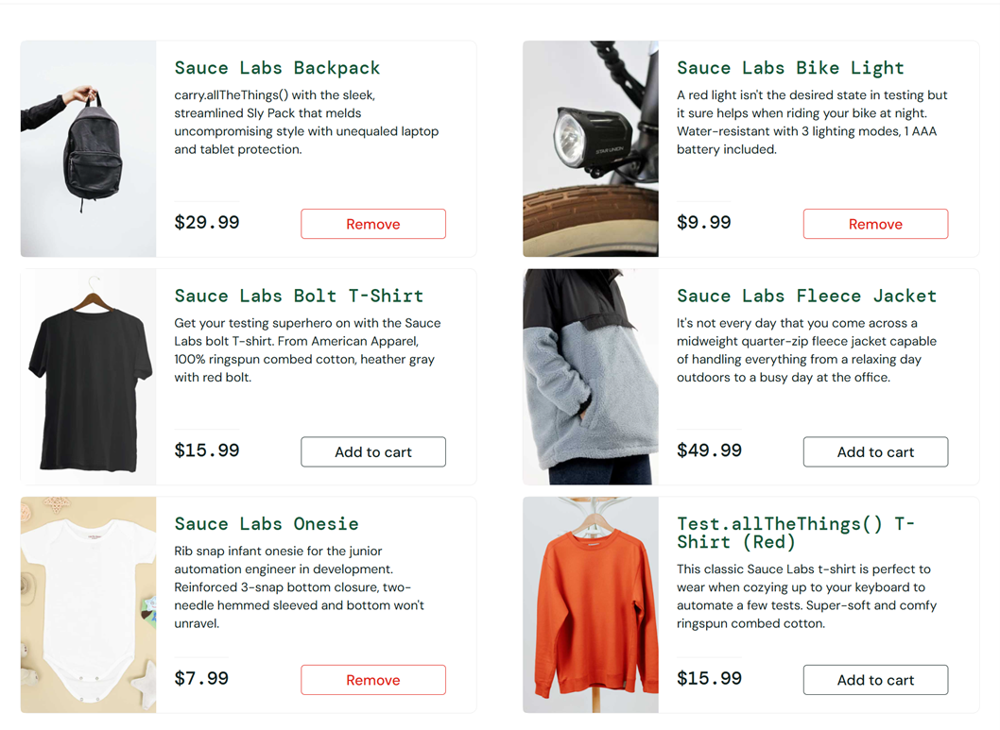

1.	Özet: error_user oturumunda, sepetten çıkarılamayan üç ürün dışındaki tüm diğer ürünlerin "Add to Cart" butonları tıklanamaz durumdadır (unresponsive).

2.	Yeniden Üretme Adımları:

    2.1. error_user ile giriş yapılır.

    2.2. "Bolt T-Shirt", "Fleece Jacket" gibi ürünlerin "Add to Cart" butonlarına tıklanır.

    2.3. Sağ üstteki sepet ikonu üzerindeki rakamın değişip değişmediği gözlemlenir.

3.	Beklenen Sonuç: Butona tıklandığında ürünün sepete eklenmesi ve sepet sayacının artması.

4.	Gerçekleşen Sonuç: Butonlara tıklanabilmesine rağmen hiçbir aksiyon gerçekleşmemekte ve ürünler sepete eklenmemektedir.

5.	Risk: Platformun temel ticari fonksiyonu olan "ürün satışı" bu kullanıcı segmenti için tamamen durmuş durumdadır.

# 8. Bug Report: BUG-008 - Checkout Button Functional Error

    Bulgu ID: BUG-008

    Bulgu Başlığı: Sepete ekranındaki "Checkout" butonunun hatalı yönlendirme yapması veya aktif olması.

    Modül: Sepet Yönetimi

    Öncelik (Priority): High (P1)

    Ciddiyet (Severity): Major (Yanlış yönlendirme)

    TC: TC-0043 - Ödeme / Checkout Akışı - İptal (Cancel) Buton Fonksiyonu

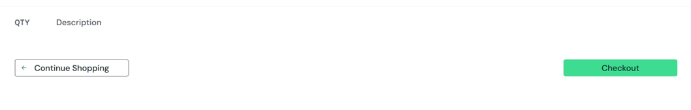
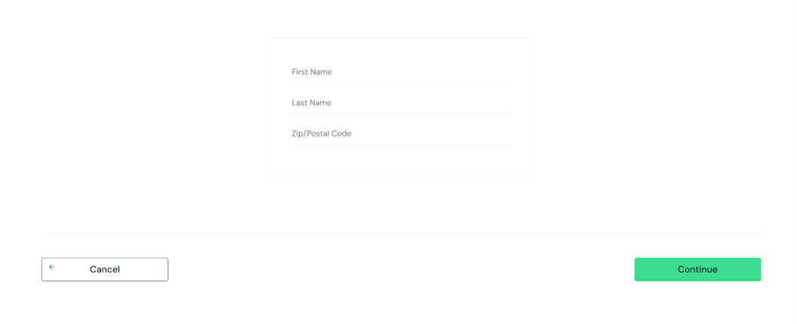

1. Özet: Sepette hiç ürün olmadığı halde Checkout butonu aktif ve ödeme sayfası öncesindeki form ekranına yönlendirmektedir.

2. Yeniden Üretme Adımları:

    2. 1.	standard_user ile giriş yapılır.

    2. 2.	Sepete hiç ürün eklenmez yada sepetteki ürünler silinir ve "Checkout" sayfasına ilerlenir.

3. Beklenen Sonuç: Kullanıcının sorunsuz bir şekilde /cart.html (Sepetim) sayfasına geri yönlendirilmesi.

4. Gerçekleşen Sonuç: "Checkout" butonu tıklandığında sistem form sayfasına ilerlemektedir.

5. Teknik Not: Buton böyle bir durumda hiç aktif olmamalı yada onClick event'i herhangi bir yönlendirme yapmamalıdır. standard_user profilinde bile bu hatanın alınması, kod seviyesinde genel bir navigasyon hatasına işaret etmektedir.

# 9. Bug Report: BUG-009 - Filter Button Clickability Issue (Visual User)

    •	Bulgu ID: BUG-009

    •	Bulgu Başlığı: Filtreleme (Sort) butonunun görsel bir katman (overlay) nedeniyle tıklanamaması.

    •	Modül: Ürün Listeleme / UI

    •	Öncelik (Priority): High (P1)

    •	Ciddiyet (Severity): Major (Fonksiyonel engel)

    •	TC: TC-0030-Ürün Listeleme ve Arama-UI Yerleşimi ve Buton Erişilebilirliği (Visual User)

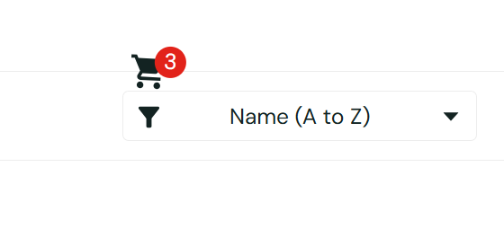

1.	Özet: visual_user oturumunda, sağ üstte bulunan "Sort" (Sıralama) dropdown butonu görünür olmasına rağmen üzerine tıklanamamaktadır.

2.	Yeniden Üretme Adımları:

    2.1. visual_user ile giriş yapılır.

    2.2. Ürün listeleme sayfasındaki sıralama butonuna tıklanmaya çalışılır.

3.	Beklenen Sonuç: Butonun aktif olması ve sıralama seçeneklerinin açılması.

4.	Gerçekleşen Sonuç: Buton tıklamaya tepki vermemektedir.

5.	Teknik Not: Bu hata genellikle bir "Z-index" çakışmasından veya görünmez bir div katmanının butonun önünde yer almasından kaynaklanır.

# 10. Bug Report: BUG-010 - Unability to Enter "Last Name" During Checkout

Bulgu ID: BUG-010

Bulgu Başlığı: Checkout aşamasında "Last Name" alanına veri girişi yapılamaması.

Modül: Ödeme / Checkout Akışı

Öncelik (Priority): High (P1)

Ciddiyet (Severity): Blocker (Form gönderimi tamamlanamıyor)

TC: TC-0044-Ödeme / Checkout Akışı-Hatalı Form Gönderimi (Error User)

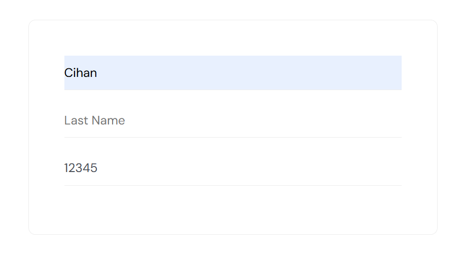

1. Özet: "error_user" oturumu ile gerçekleştirilen checkout işleminde, "Last Name" input alanı kullanıcı girişine kapalıdır veya girilen veriyi kabul etmemektedir.

2. Yeniden Üretme Adımları:

    2.1. https://www.saucedemo.com adresine gidilir.

    2.2. error_user kullanıcı adı ve secret_sauce şifresi ile giriş yapılır.

    2.3. Herhangi bir ürün sepete eklenir ve sepet ikonuna tıklanır.

    2.4. "Checkout" butonuna basılır.

    2.5. "First Name" alanı doldurulur.

    2.6. "Last Name" alanına veri girişi yapılmaya çalışılır.

3. Beklenen Sonuç: "Last Name" alanına metin girişi yapılabilmesi ve girilen karakterlerin alanda görünmesi.

4. Gerçekleşen Sonuç: "Last Name" alanına odaklanılmasına veya klavye girişi yapılmasına rağmen hiçbir karakter girişi yapılamadığı görüldü (Alan kilitli veya "Failed" statüsünde).

5. Risk: Kullanıcılar soyadı bilgisini giremedikleri için ödeme adımına soyadı olmadan geçemekte. Bu durum sipariş takibini zorlaştırır.

# 11. Bug Report: BUG-011 - Sort Functionality Failure (Visual User)

•	Bulgu ID: BUG-011

•	Bulgu Başlığı: Sıralama (Sort) işleminin verileri doğru organize etmemesi.

•	Modül: Ürün Listeleme / Fonksiyonel

•	Öncelik (Priority): Medium (P2)

•	Ciddiyet (Severity): Major (Yanlış veri gösterimi)

•	TC: TC-0028-Ürün Listeleme ve Arama-Etkisiz Filtreleme/Sıralama (Visual User)

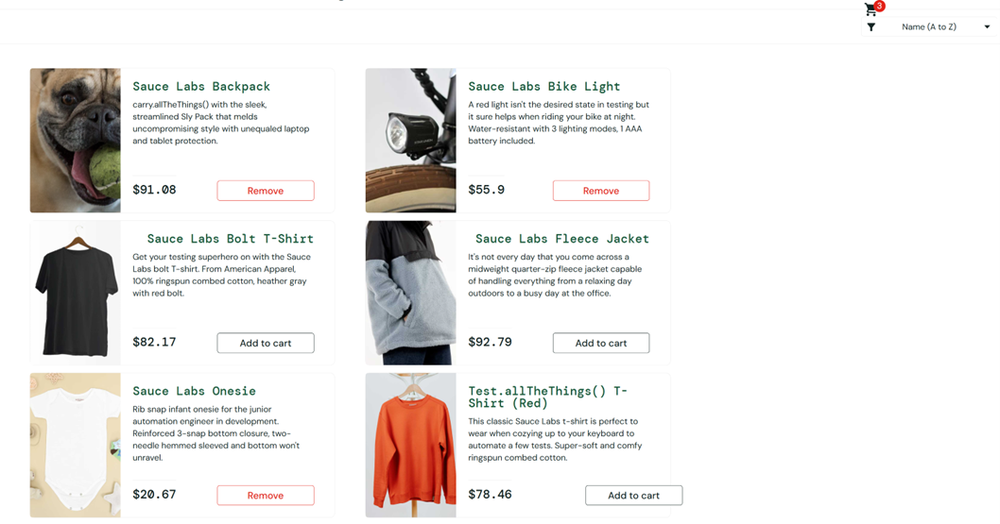
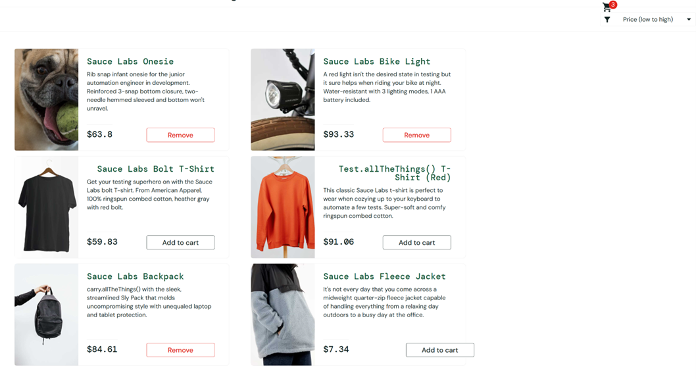

1.	Özet: Sıralama menüsünden bir seçenek (Örn: Price Low to High) seçilse dahi, ürünlerin sırası değişmemekte veya rastgele bir sırada kalmaktadır.

2.	Yeniden Üretme Adımları:

    2.1. visual_user ile giriş yapılır. (Eğer buton tıklanabiliyorsa veya klavye ile seçilebiliyorsa) sıralama değiştirilir.

    2.2. Ürün fiyatları/isimleri kontrol edilir.

3.	Beklenen Sonuç: Seçilen kriterin (A-Z veya Fiyat) anında listeye yansıması.

4.	Gerçekleşen Sonuç: Liste sıralaması güncellenmemektedir.

# 12. Bug Report: BUG-012 - Missing Validation Errors for Mandatory Fields at Checkout

Bulgu ID: BUG-012

Bulgu Başlığı: Checkout formunda boş bırakılan Last Name zorunlu alanı için hata mesajı/uyarı gösterilmemesi.

Modül: Ödeme / Checkout Akışı

Öncelik (Priority): Medium (P2)

Ciddiyet (Severity): Major (Veri bütünlüğü ve validasyon hatası)

TC: TC-0044-Ödeme / Checkout Akışı-Hatalı Form Gönderimi (Error User)

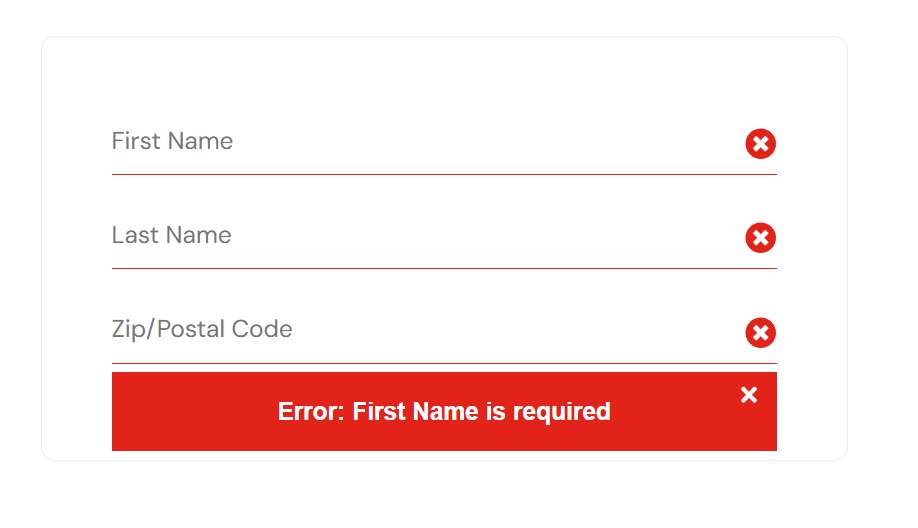
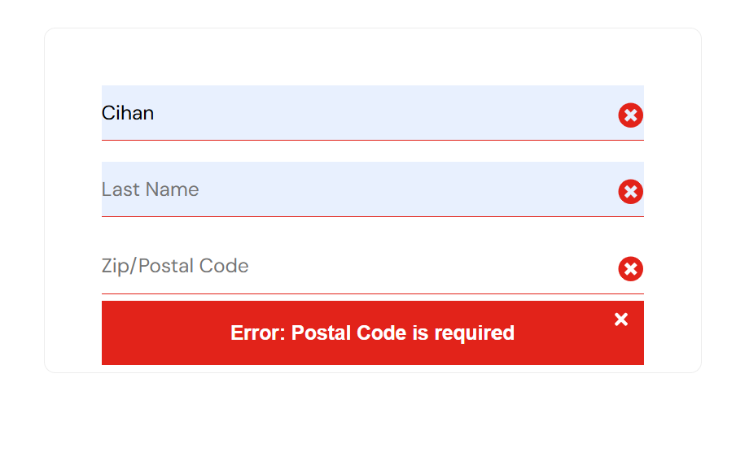
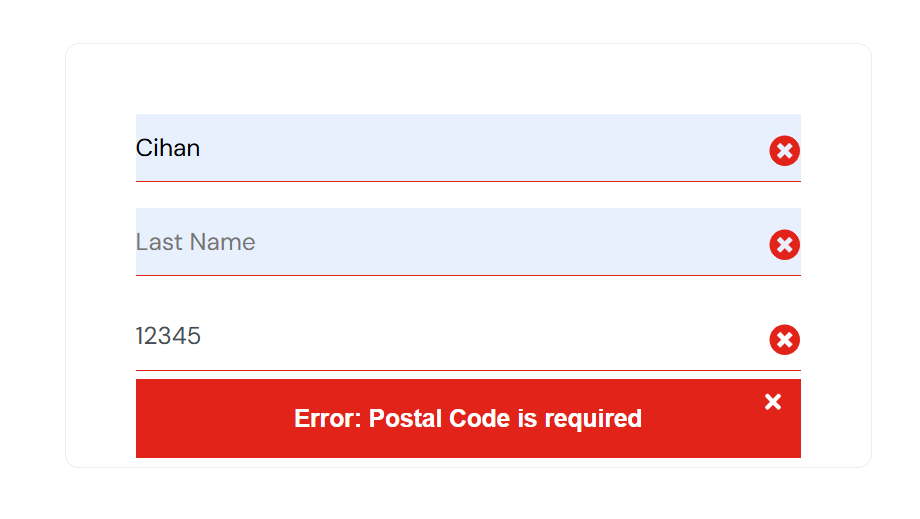
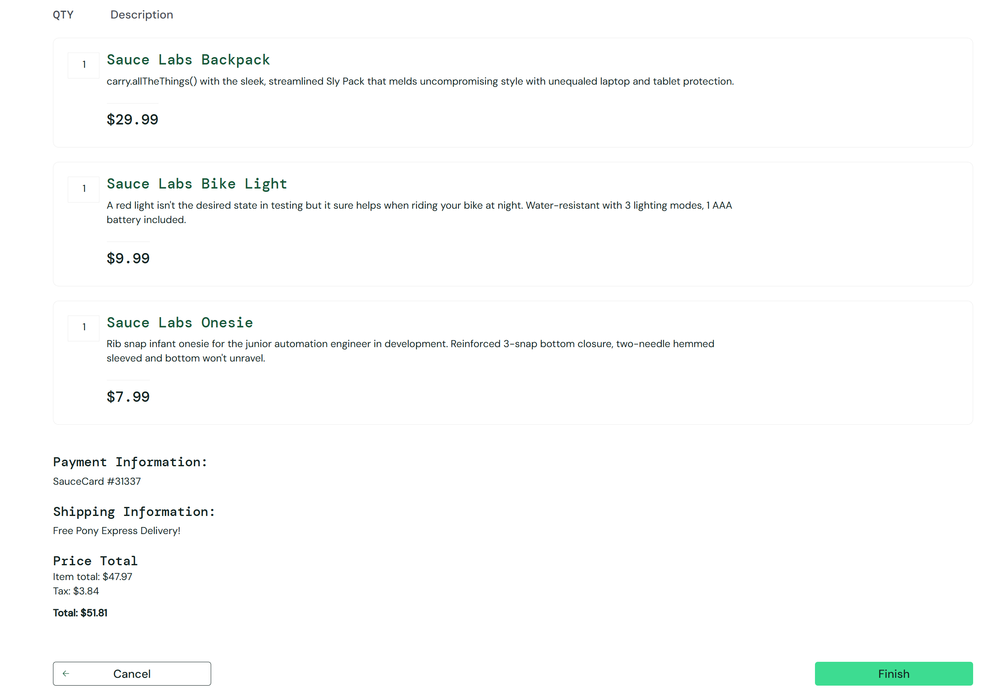

1. Özet: "error_user" oturumunda, Checkout aşamasındaki zorunlu alanlar (First Name, Last Name, Zip/Postal Code) boş bırakılarak form gönderilmeye çalışıldığında, sistem kullanıcıya herhangi bir hata uyarısı göstermemektedir.

2. Yeniden Üretme Adımları:

    2.1. https://www.saucedemo.com adresine gidilir.

    2.2. error_user ile giriş yapılır.

    2.3. Sepete ürün eklenir ve Checkout sayfasına gidilir.

    2.4. "Last Name" alanı tamamen boş bırakılır.

    2.5. "Continue" (Devam) butonuna tıklanır.

    2.6.Sayfada bir uyarı mesajı çıkıp çıkmadığı kontrol edilir.

3. Beklenen Sonuç: Formun gönderilmemesi ve boş bırakılan alanlar için "First Name is required" gibi belirgin bir zorunluluk (validation) uyarısının çıkması.

4. Gerçekleşen Sonuç: Zorunluluk uyarısının çıkmadığı görüldü; sistem hatalı/boş girişe tepki vermiyor.

5. Risk: Geçersiz veya eksik verilerle sipariş oluşturulmasına zemin hazırlar. Kullanıcı deneyimi açısından kafa karıştırıcıdır ve veritabanında eksik kayıt oluşmasına veya sistemin ilerleyen aşamalarda çökmesine neden olabilir.

# 13. Bug Report: BUG-013 - Checkout Proceeding Despite Missing Mandatory "Last Name" Field

Bulgu ID: BUG-013

Bulgu Başlığı: "Last Name" alanı boş olmasına rağmen sistemin bir sonraki checkout aşamasına geçişe izin vermesi.

Modül: Ödeme / Checkout Akışı

Öncelik (Priority): High (P1)

Ciddiyet (Severity): Critical (İş mantığı ve veri bütünlüğü ihlali)

TC: TC-0044-Ödeme / Checkout Akışı-Hatalı Form Gönderimi (Error User)

1. Özet: "error_user" ile yapılan testte, "Last Name" alanına (BUG-008 nedeniyle) veri girişi yapılamamasına ve alanın boş kalmasına rağmen, "Continue" butonuna basıldığında sistemin hata vermesi gerekirken bir sonraki ödeme onay sayfasına ilerlediği tespit edilmiştir.

2. Yeniden Üretme Adımları:

    2.1. https://www.saucedemo.com adresine gidilir.

    2.2. error_user bilgileriyle giriş yapılır.

    2.3. Ürün sepete eklenir ve Checkout sayfasına gidilir.

    2.4. "First Name" ve "Zip/Postal Code" alanları geçerli verilerle doldurulur.

    2.5. "Last Name" alanı boş bırakılır (veya BUG-008 nedeniyle veri girilemediği teyit edilir).

    2.6. "Continue" butonuna tıklanır.

    2.7. Uygulamanın bir sonraki sayfaya geçip geçmediği gözlemlenir.

3. Beklenen Sonuç: Eksik zorunlu alan (Last Name) nedeniyle formun reddedilmesi, kullanıcıya hata mesajı gösterilmesi ve aynı sayfada kalınması.

4. Gerçekleşen Sonuç: Zorunlu alan boş olmasına rağmen sistemin hata vermediği ve Checkout sayfasına (Ödeme Özet sayfasına) başarıyla geçildiği görüldü.

5. Risk: Veritabanında soyadı bilgisi eksik olan hatalı siparişlerin oluşmasına neden olur. Finansal kayıtlar ve kargo süreçleri için kritik olan zorunlu alan kontrolü (Server-side/Client-side validation) tamamen devre dışı kalmış durumdadır.

# 14. Bug Report: BUG-014 - Missing Character Limit for "First Name" Field

Bulgu ID: BUG-014

Bulgu Başlığı: Checkout formunda "First Name" alanı için karakter sınırı (maxlength) tanımlanmaması.

Modül: Ödeme / Checkout Akışı

Öncelik (Priority): Low (P3)

Ciddiyet (Severity): Minor (UI/UX ve Veri Tutarlılığı)

TC: TC-0046-Karakter ve Tip Denetimi-First Name

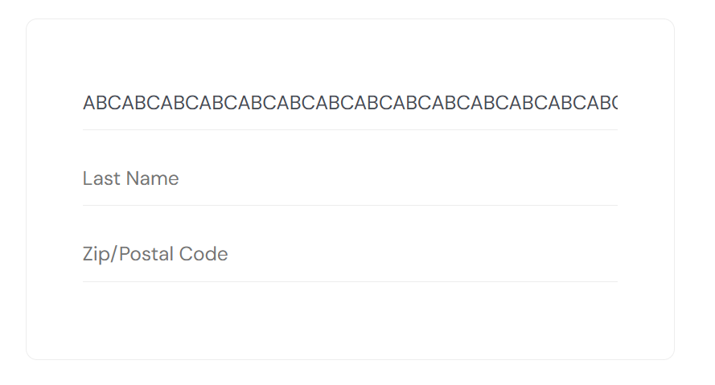

1. Özet: Checkout sayfasındaki "First Name" input alanında herhangi bir karakter sınırlaması bulunmamaktadır. Kullanıcı, makul olmayan uzunlukta veri girişi yapabilmektedir.

2. Yeniden Üretme Adımları:

    2.1. standard_user ile giriş yapılıp Checkout sayfasına ilerlenir.

    2.2. "First Name" alanına aşırı uzun (örn. 1000+ karakter) bir metin girilir.

    2.3. Uygulamanın girişi durdurup durdurmadığı veya hata verip vermediği kontrol edilir.

3. Beklenen Sonuç: maxlength özniteliğinin tanımlı olması veya sistemin kontrollü bir hata mesajı vermesi.

4. Gerçekleşen Sonuç: maxlength tanımlanmadığı için sınırsız karakter girişi yapılabiliyor.

5. Risk: Buffer overflow riskleri, veritabanı kayıt hataları ve sayfa düzeninin (UI) aşırı uzun metinler nedeniyle bozulması.

# 15. Bug Report: BUG-015 - Missing Character Limit for "Last Name" Field

Bulgu ID: BUG-015

Bulgu Başlığı: Checkout formunda "Last Name" alanı için karakter sınırı (maxlength) tanımlanmaması.

Modül: Ödeme / Checkout Akışı

Öncelik (Priority): Low (P3)

Ciddiyet (Severity): Minor (UI/UX ve Veri Tutarlılığı)

TC: TC-0047-Karakter ve Tip Denetimi-Last Name

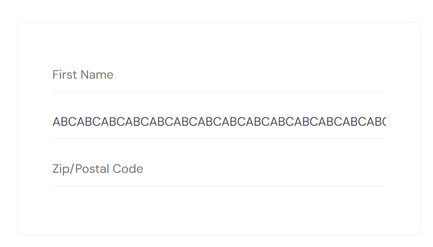

1. Özet: "Last Name" alanı için giriş denetimi eksiktir; alan her türlü uzunluktaki karakter dizisini kabul etmektedir.

2. Yeniden Üretme Adımları:

   2.1. standard_user ile giriş yapılıp Checkout sayfasına ilerlenir.

   2.2. "Last Name" alanına çok uzun bir karakter dizisi girilir. (örn. 1000+ karakter)

3. Beklenen Sonuç: Uygulamanın makul bir karakterde girişi durdurması.

4. Gerçekleşen Sonuç: Herhangi bir kısıtlama olmaksızın sınırsız karakter girişi yapılabiliyor.

5. Risk: Veri bütünlüğünün bozulması ve UI esnemesi.

# 16. Bug Report: BUG-016 - Missing Character Limit for "ZIP / Postal Code" Field

Bulgu ID: BUG-016

Bulgu Başlığı: Checkout formunda "ZIP / Postal Code" alanı için karakter sınırı tanımlanmaması.

Modül: Ödeme / Checkout Akışı

Öncelik (Priority): Medium (P2)

Ciddiyet (Severity): Minor (Format/Validasyon Eksikliği)

TC: TC-0048-Karakter ve Tip Denetimi-ZIP / Postal Code

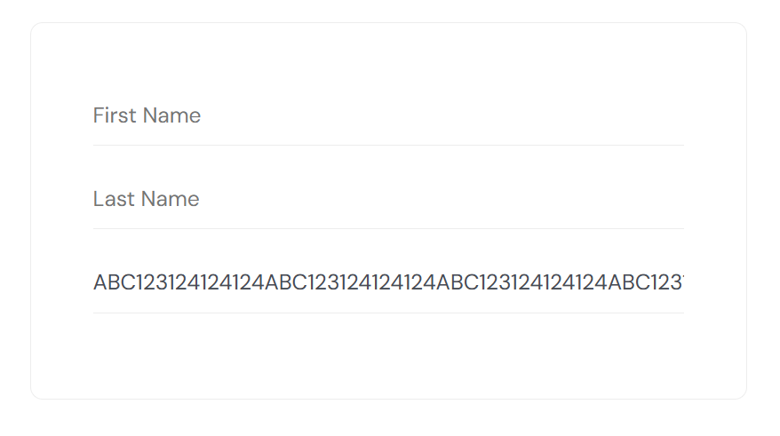

1. Özet: Posta kodu alanı, standart posta kodu formatlarının çok üzerinde veri girişine izin vermektedir.

2. Yeniden Üretme Adımları:

    2.1. standard_user ile giriş yapılıp Checkout sayfasına ilerlenir.

    2.2. "ZIP / Postal Code" alanına sınırsız karakter girilir. (örn. 1000+ karakter)

3. Beklenen Sonuç: Posta kodu standartlarına uygun bir karakter limiti (örn. 5-10 karakter) uygulanması.

4. Gerçekleşen Sonuç: maxlength tanımlanmadığı için sınır gözetmeksizin giriş yapılabiliyor.

5. Risk: Hatalı adres verilerinin sisteme kaydedilmesi ve lojistik süreçlerde yaşanabilecek aksaklıklar.
